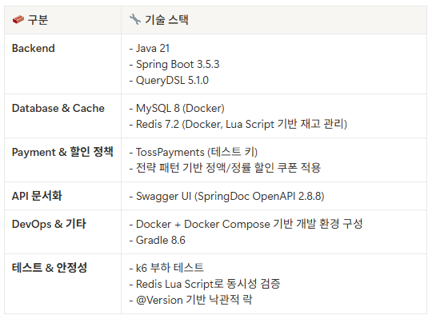
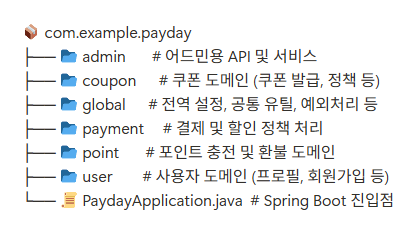
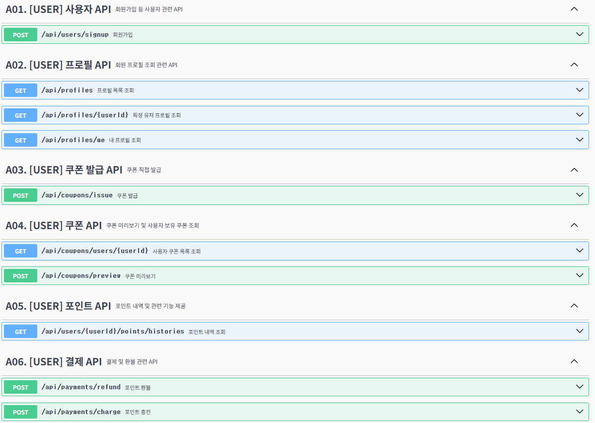
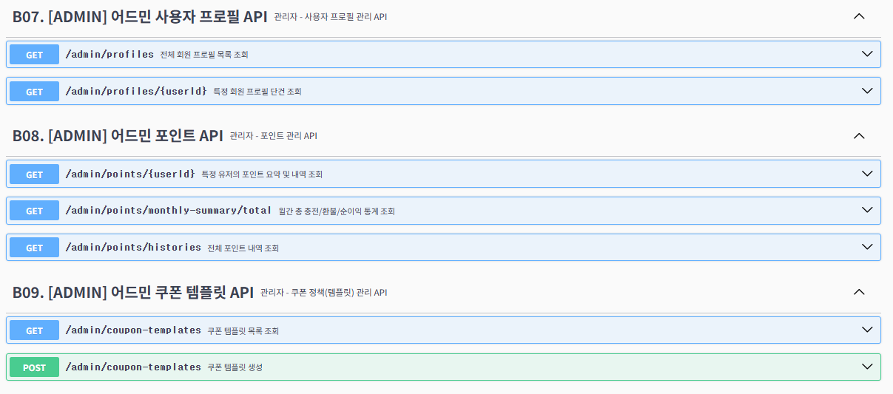

## ✅ 프로젝트 소개 및 기술 스택

이 프로젝트는 **회원 프로필 조회 및 포인트 충전 기능을 중심으로 실무 수준의 확장성과 안정성, 구조적 설계**를 목표로 개발된 백엔드 시스템입니다.

- **MSA 전환이 용이한 DDD 도메인 분리 구조**를 채택하여 도메인별 관심사를 분리했습니다.
- **전략 패턴, 낙관적 락(@Version), Redis Lua Script** 등 실무에서 자주 사용하는 기술 패턴을 적용하여 **성능과 동시성 안정성**을 확보했습니다.
- **Swagger 기반 API 테스트 문서화**, **성능 테스트(k6)**, **결제 게이트웨이 추상화**, **전역 할인 정책**, **N+1 문제 해결** 등 다양한 부가기능을 포함하여 **요구사항 이상의 기능**을 완성했습니다.
- DTO ↔ Entity 간 변환 책임을 명확히 분리하기 위해 전용 매퍼 클래스(PaymentMapper 등)를 구성하여, 서비스의 역할을 축소하고 구조적 유지보수성을 강화했습니다.

---
<table align="center">
  <tr>
    <td align="center" width="50%">
      <b>✅ 기술 스택</b><br>
      <br>
    </td>
    <td align="center" width="50%">
      <b>✅ 폴더 구조</b><br>
      <br>
      <a href="docs/folder-structure.md" target="_blank">
      </a>
    </td>
  </tr>
  <tr>
    <td align="center" width="50%">
      <b>✅ Swagger UI 메인</b><br>
      <br>
      <p><i>💡 아래 버튼은 Spring Boot 애플리케이션(Docker 실행 포함) 실행 후 접근 가능합니다</i></p>
      <a href="http://localhost:8080/swagger-ui/index.html" target="_blank">
        
      </a>
    </td>
    <td align="center" width="50%">
      <b>✅ API 명세 예시</b><br>
      <br>
      <a href="docs/folder-structure.md" target="_blank">
      </a>
    </td>
  </tr>
</table>

---

## ✅ 프로젝트 구조 및 아키텍처 개요

- 이 프로젝트는 **MSA 전환에 용이하도록 DDD 구조로 도메인을 분리**하였습니다.
- **일반 사용자와 관리자의 기능을 분리**하여, `admin` 계층에서는 신고 누적, 정지 여부, 누적 수익 등 **어드민 전용 정보**를 조회할 수 있습니다.
- **전략 패턴**, **낙관적 락(@Version)**, **Redis Lua Script**, **전용 매퍼 클래스 분리 구성** 등 실무에서 유용한 설계 패턴과 기술을 적극적으로 적용하여 **성능과 확장성**을 고려하였습니다.
- 전 API는 Swagger 문서를 통해 테스트 가능하도록 구성되어 있으며, 각 API 응답 예시도 포함되어 있습니다.
- 기본 요구사항 외에도 **결제 게이트웨이 추상화, 전역 할인 정책, 쿠폰 미리보기, N+1 문제 해결, 성능 테스트** 등 실무 수준의 기능들을 구현했습니다.

---

## ✅ 핵심 기능 요약 (과제 요구사항 및 추가 구현 포함)

| 기능 | 설명                                                               | 기술 스택 및 패턴                                                                      |
|------|------------------------------------------------------------------|---------------------------------------------------------------------------------|
| **관리자 API 분리 설계** | 사용자/운영자 기능을 명확히 분리하여 유지보수성과 보안성 확보 | 실무 기반 역할 분리, `/admin/**` 권한 제어 적용 [`자세히 보기`](docs/#api-구성-요약-일반-사용자--어드민-분리-설계.md) |
| **회원 프로필 목록 조회** | 정렬, 페이징, 조회수 포함                                                  | QueryDSL, Pageable, WebConfig, Swagger [`자세히 보기`](docs/#회원-프로필-조회.md)              |
| **회원 프로필 상세 조회수 증가** | 조회수 업데이트 API                                                     | 단건 업데이트 쿼리, QueryDSL [`자세히 보기`](docs/#조회수-업데이트.md)                                 |
| **포인트 충전** | 토스페이먼츠 기반 결제 및 포인트 적립<br>Fake 게이트웨이(FakePaymentGateway)로 테스트 환경 지원 | 전략 패턴(PaymentGateway), @Profile [`자세히 보기`](docs/#포인트-충전.md)                        |
| **포인트 환불 & 이력 조회** | 기존 충전 내역 기반 환불 처리 + 전체 포인트 내역 페이징 조회 지원 | 낙관적 락(@Version), 중복 환불 방지, 페이징 조회 [`자세히 보기`](docs/#포인트-환불--이력-조회.md)               |
| **쿠폰 할인 적용** | 정액/정률 쿠폰 할인 적용                                                   | 전략 패턴(CouponDiscountPolicy), Map 기반 DI [`자세히 보기`](docs/#쿠폰-할인.md.md)                  |
| **쿠폰 발급** | 쿠폰 템플릿 기반 유저별 단 1회 발급<br>Redis Lua Script 활용                     | Redis Lua Script, 재고 체크, 중복 방지 [`자세히 보기`](docs/#쿠폰-발급.md)                          |
| **전역 할인 정책 구성** | 연휴/장애 보상 등 상황별 할인 설정                                             | 전략 패턴(DiscountPolicy), @Profile [`자세히 보기`](docs/#전역-할인.md)                         |
| **API 명세 문서화** | Swagger UI로 문서 자동화                                               | SpringDoc + Swagger3 [`자세히 보기`](docs/#swagger-ui.md)                               |
| **성능 테스트** | 동시성 상황 테스트 및 통계 측정 (쿠폰 선착순 포함)                                   | k6 부하 테스트, Redis Lua Script [`자세히 보기`](docs/#성능-테스트.md)                            |
| **예외 처리 구조** | 전역 ErrorCode + 커스텀 Exception 구성                                  | ErrorCode enum, BaseException, Swagger 적용 [`자세히 보기`](docs/#예외-처리.md)               |

---

## ✅ 도커 실행 방법

이 프로젝트는 별도의 프로그램 설치 없이 Docker를 통해 실행할 수 있습니다.

### 1. Docker 이미지 빌드

```bash
docker build -t payday-app .
````

### 2. Docker 실행

```bash
docker run -p 8080:8080 --name payday payday-app
```

### 3. Swagger 접속

```
http://localhost:8080/swagger-ui/index.html
```

### 📦 기타

* `Dockerfile`은 JDK 21 및 Gradle 기반으로 구성되어 있으며, `application.yml`은 내부 H2 또는 MySQL에 연결됩니다.
* 테스트를 위한 Redis 및 MySQL은 Docker Compose를 통해 함께 실행 가능합니다. (필요시 `docker-compose.yml` 구성 제공 가능)

---


