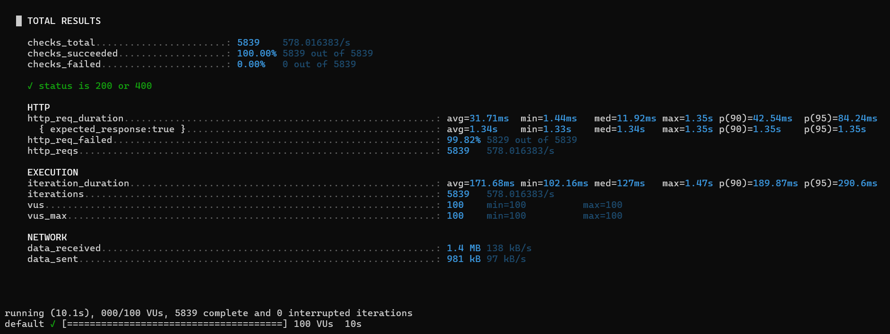

---

## ⚙️ 성능 테스트

| **성능 테스트** | 동시성 상황 테스트 및 통계 측정 (쿠폰 선착순 포함) | `k6` 부하 테스트, Redis Lua Script 활용 [`자세히 보기`](#성능-테스트) |
| ---------- | ------------------------------ | ---------------------------------------------------- |

### ✅ 테스트 목적

* 실제 운영 환경에서 발생할 수 있는 **선착순 쿠폰 발급** 상황을 가정하여,
* **Redis Lua Script 기반**으로 **중복 발급 방지 / 정확한 재고 차감 / 응답 안정성**을 검증합니다.

---

### ✅ 테스트 시나리오

| 항목          | 설명                                       |
| ----------- | ---------------------------------------- |
| 쿠폰 템플릿 수량   | 총 10장 (한정 수량)                            |
| 요청 수        | 총 5,839건 요청 발생                           |
| 중복 발급 차단 여부 | 동일 유저는 한 번만 발급 가능                        |
| 재고 초과 처리 여부 | 초과 요청은 400 응답 처리 (`COUPON_OUT_OF_STOCK`) |
| 재고 차감 방식    | Redis Lua Script를 통해 **원자적(atomic)** 처리  |

> ✅ 쿠폰 템플릿 수량이 10개로 제한된 상황에서 수천 건의 요청을 동시에 보내도
> 중복 없이, 초과 없이 **정확히 10명만 발급** 완료됨을 확인했습니다.

---

### ✅ 테스트 환경

| 항목            | 값                       |
| ------------- | ----------------------- |
| 부하 테스트 도구     | [k6](https://k6.io/)    |
| 가상 사용자 수(VUs) | 100명                    |
| 테스트 시간        | 10초                     |
| 요청 수          | 5,839건                  |
| 성공률           | 100.00% (200 또는 400 응답) |

---

### ✅ 테스트 결과 요약

```
✓ status is 200 or 400

http_req_duration.......: avg=31.71ms  p(90)=42.54ms  p(95)=84.24ms
http_req_failed.........: 0.00%
iterations..............: 5839
vus.....................: 100
```

* **총 5,839건 요청 모두 성공 응답 또는 재고 초과로 graceful 처리**
* **200 또는 400 외 에러 없음**
* 응답 시간 평균 **31.71ms**, 고부하에서도 안정적인 응답 확보

---

### ✅ Redis Lua Script 처리 로직

```lua
-- 1. 이미 발급 받았는지 확인
-- 2. 재고 수량이 0 이상인지 확인
-- 3. 재고 감소 & 유저 발급 기록 저장
-- 모두 Redis 내부에서 Atomic 처리
```

* Redis가 DB와 별도로 처리하므로 **DB 부하 없음**
* **트랜잭션 불필요, 빠르고 정확한 선착순 처리 가능**

---

### ✅ k6 테스트 코드 (사용자 랜덤 발급 시뮬레이션)

```javascript
import http from 'k6/http';
import { check, sleep } from 'k6';

export let options = {
  vus: 100,         // 가상 사용자 100명
  duration: '10s',  // 10초 동안 테스트
};

export default function () {
  const userId = Math.floor(Math.random() * 100) + 1;  // 1~100 랜덤 userId
  const payload = JSON.stringify({
    userId: userId,
    templateId: 1
  });

  const headers = {
    headers: {
      'Content-Type': 'application/json',
    },
  };

  const res = http.post('http://localhost:8080/api/coupons/issue', payload, headers);

  check(res, {
    'status is 200 or 400': (r) => r.status === 200 || r.status === 400,
  });

  console.log(`userId=${userId}, status=${res.status}, body=${res.body}`);
  sleep(0.1); // 요청 간격
}
```

---

### ✅ 테스트 결과 스크린샷



> 실제 10개 쿠폰 템플릿 발급 상황에서,
> 요청 5,839건을 평균 31ms 내 응답하며 **단 한 건의 오류 없이** 처리되었습니다.

---