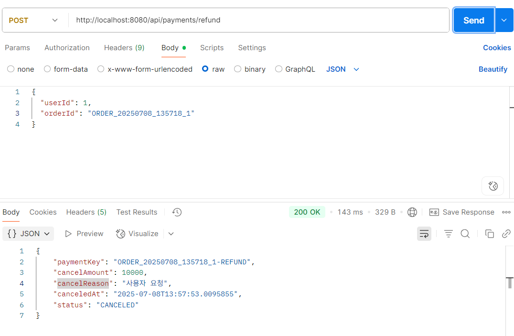
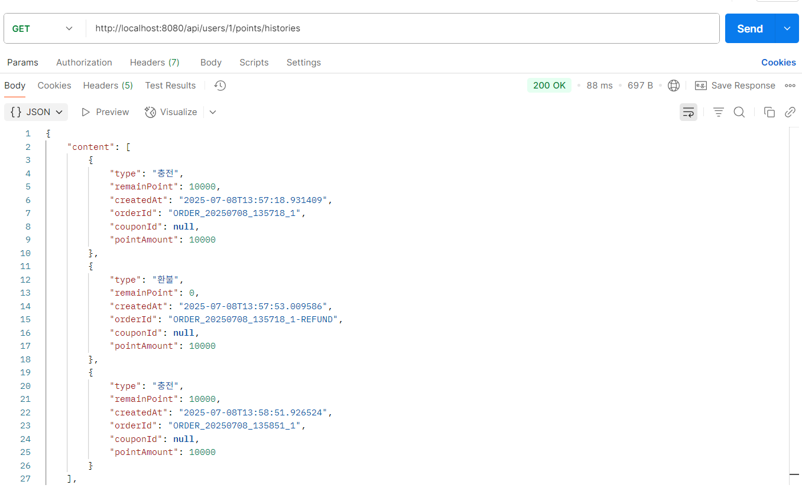

---

## 🔄 포인트 환불 & 이력 조회

### ✅ 요구사항 요약

| 기능     | 설명                                                 |
| ------ | -------------------------------------------------- |
| 포인트 환불 | 기존 충전 이력을 기반으로 포인트를 회수하며, **중복 환불 방지 및 동시성 제어** 필요 |
| 이력 조회  | 사용자의 전체 포인트 내역(충전/환불)을 **최신순 + 페이징 형태**로 조회 가능     |

---

### ⚙️ 환불 처리 흐름

1. 사용자로부터 `orderId`를 입력받아 환불 요청 → `POST /api/payments/refund`
2. 환불 ID는 `원래 주문 ID + "-REFUND"` 형식으로 생성
   예: `ORDER_20250705_145428_1 → ORDER_20250705_145428_1-REFUND`
3. 환불 ID가 이미 존재하면 `PointHistory.existsByOrderId()`를 통해 중복 환불 차단
4. 환불 성공 시 기존 충전 금액만큼 포인트 차감 + 환불 이력 저장

---

### 🧠 적용 기술 요약

| 항목        | 설명                                                             |
| --------- | -------------------------------------------------------------- |
| 낙관적 락     | `User` 엔티티의 `@Version` 필드를 통해 **동시 환불 충돌 방지**                  |
| 중복 환불 방지  | 환불 ID를 `-REFUND` 접미사로 생성 후, **이미 존재하는지 검사**하여 중복 차단            |
| 포인트 차감 처리 | 기존 충전 금액 기준으로 `user.usePoint(amount)` 호출하여 포인트 회수              |
| 포인트 이력 조회 | `GET /api/points/history?userId=1&page=0&size=3` 형태로 페이징 조회 지원 |

---

### 🧪 테스트 결과 요약

| 테스트 항목       | 확인 결과                              |
| ------------ | ---------------------------------- |
| 환불 요청 처리     | ✅ 포인트 차감 + 환불 이력(`-REFUND`) 저장 확인됨 |
| 중복 환불 차단     | ✅ 동일 주문 ID에 대해 중복 요청 시 예외로 정상 처리됨  |
| 전체 이력 페이징 조회 | ✅ 최신순 충전/환불 내역이 페이징 형태로 정상 반환됨     |

---

### 📸 테스트 예시 결과

| 환불 처리 결과                                                      | 전체 포인트 이력 조회 결과                                                |
| ------------------------------------------------------------- | -------------------------------------------------------------- |
|  |  |

---

✔️ 충전, 환불, 이력 조회까지 포인트 기능이 **정확히 분리되어 잘 동작함을 확인**했습니다.

---
