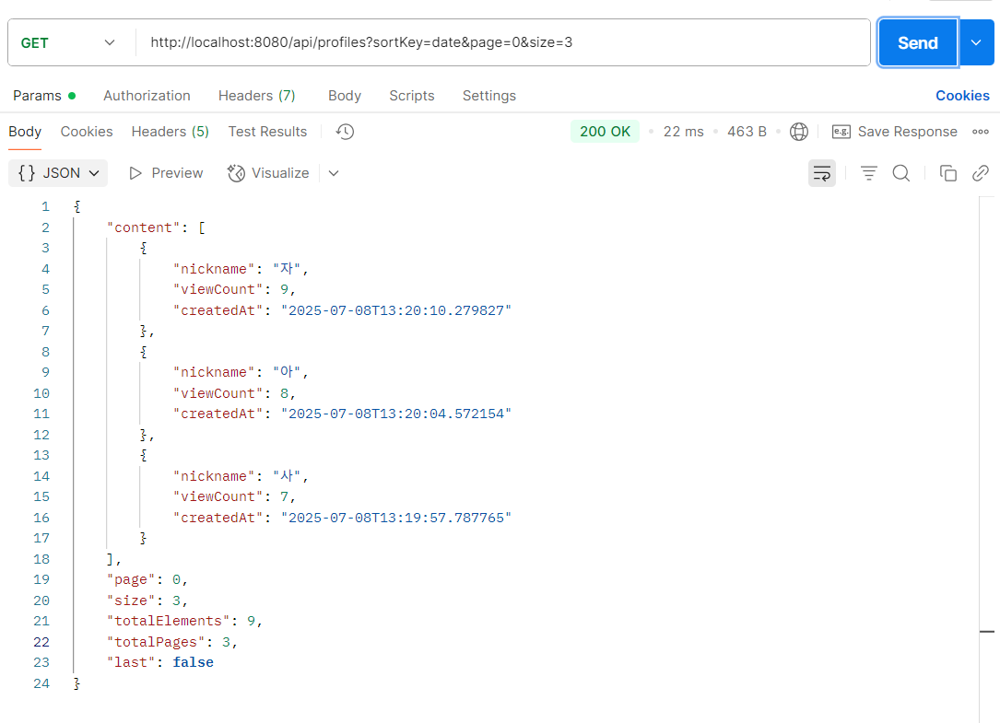

---

## ✅ 회원 프로필 목록 조회 정렬 기능 테스트

**과제 요구사항:**

* 회원 프로필 목록에서 정렬 기능(이름 가나다순, 조회순, 등록 최신순)을 제공
* 페이징(Pagination) 기능 포함
* 각 프로필에는 `닉네임`, `조회수(viewCount)`, `등록일(createdAt)`이 포함되어야 함

---

### 🅰️ 정렬 기준: 이름순 (닉네임 가나다순)

✅ 테스트 조건:

* 사전에 닉네임이 **가, 나, 다, 라, 마, 바, 사, 아, 자**인 유저 9명을 생성
* 파라미터: `sortKey=name`, `page=0`, `size=3`

✅ 기대 결과:

* 닉네임 가나다순으로 정렬되어 **가 → 나 → 다** 순으로 응답

✅ 테스트 결과:

* 정렬 기준(name)이 정상적으로 동작함을 확인
* 아래 이미지에서 확인 가능

 

---

### 🅱️ 정렬 기준: 조회순 (`viewCount` 기준)

✅ 테스트 조건:

* 위 9명의 사용자에게 각각 1회 \~ 9회까지 수동으로 조회 수행
  (예: `가=1`, `나=2`, ..., `자=9`)
* 파라미터: `sortKey=view`, `page=0`, `size=3`

✅ 기대 결과:

* 조회수가 높은 순서대로 **자(9회) → 아(8회) → 사(7회)** 응답

✅ 테스트 결과:

* 정렬 기준(viewCount)이 정상적으로 작동함을 확인
* 아래 이미지에서 확인 가능

 

---

### 🆎 정렬 기준: 등록일 기준 (`createdAt` 최신순)

✅ 테스트 조건:

* 같은 9명의 사용자를 `가` → `자` 순으로 등록하여
  가장 마지막에 등록된 사용자가 `자`
* 파라미터: `sortKey=date`, `page=0`, `size=3`

✅ 기대 결과:

* 최신 등록일 기준으로 **자 → 아 → 사** 순서로 응답

✅ 테스트 결과:

* 정렬 기준(createdAt)이 정상적으로 작동함을 확인
* 아래 이미지에서 확인 가능

 

---

