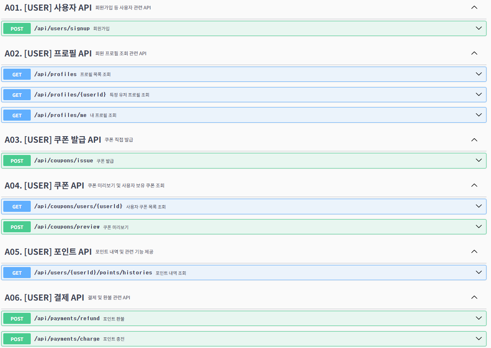
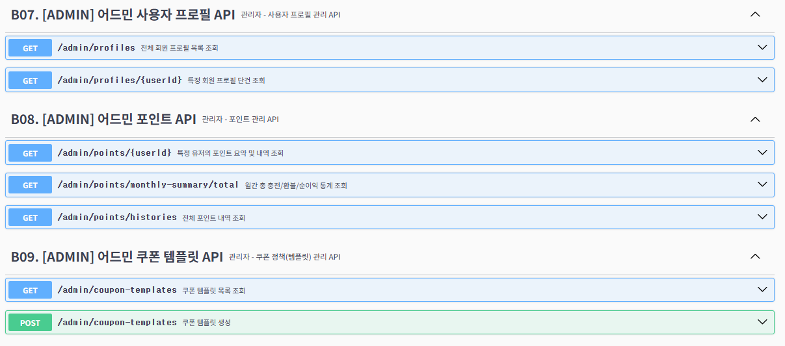

---

## 📘 Swagger UI 기반 API 명세 문서화

SpringDoc + Swagger3 조합을 활용해 모든 API를 자동 문서화했습니다.  
아래와 같은 원칙과 구성을 따랐습니다:

| 항목                 | 설명                                                                 |
|--------------------|----------------------------------------------------------------------|
| **스키마 기반 명세화**   | `@Schema`, `@Operation`, `@ApiResponse` 등을 활용해 상세 설명 및 예시 제공     |
| **그룹별 태그 정리**    | `[USER]`, `[ADMIN]` 등 태그로 API를 기능/역할 기준으로 구분하여 관리             |
| **전역 에러 응답 통일** | 모든 API에서 동일한 `ErrorResponse` 구조를 사용해 예외 메시지를 일관되게 처리        |
| **요청 DTO 명세화**    | 각 필드에 `@Schema(description, example)` 적용 → Swagger UI에서 상세 명세 확인 가능 |
| **응답 래퍼 구조 명세화** | `PagedResponse<T>` 구조도 Swagger에서 인식 가능하도록 문서화                     |

---

### 📌 에러 응답 예시

```json
{
  "message": "존재하지 않는 사용자입니다.",
  "code": "USER_NOT_FOUND",
  "status": 404
}
````

실제 에러 메시지는 ErrorCode 기반으로 API마다 상세하게 관리됩니다.

---


### 📘 Swagger 적용 화면

| 사용자 API 목록 (`/api/**`)                                  | 관리자 API 목록 (`/admin/**`)                                 |
| ------------------------------------------------------- | -------------------------------------------------------- |
|  |  |


---

> Swagger UI는 프로젝트 실행 후 `http://localhost:8080/swagger-ui/index.html` 경로에서 확인 가능합니다.


