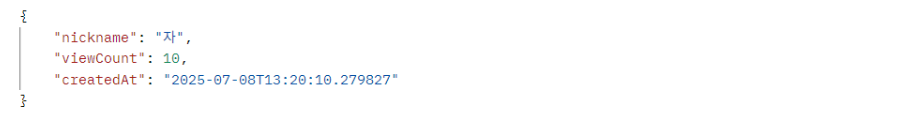
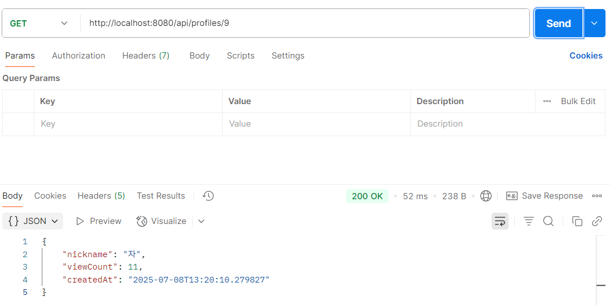

---

## 🔍 회원 프로필 상세 조회 시 조회수 증가 테스트

###  기능 설명

* `/api/profiles/{userId}` API는 특정 회원의 프로필을 상세 조회할 수 있습니다.
* 이때, **해당 프로필의 조회수(`viewCount`)는 자동으로 1 증가**합니다.

---

### 🧪 테스트 절차

1. **초기 상태 확인**

   * 사용자 `자`(id: 9)의 프로필을 조회하기 전 상태
     → `viewCount = 10`

      

   

2. **상세 조회 API 호출**

   * `/api/profiles/9` 호출 (Postman 또는 클라이언트에서 조회 시도)

3. **결과 확인**

   * 응답 결과에서 `viewCount = 11`로 **1 증가**된 것을 확인

      

   

---

### 📝 테스트 결과

*  **상세 조회 시마다 `viewCount`가 자동으로 1씩 증가**하는 기능이 정상적으로 동작함을 확인했습니다.
* 이는 이후 `조회순 정렬(sortKey=view)`의 기준 데이터로 활용됩니다.

---
