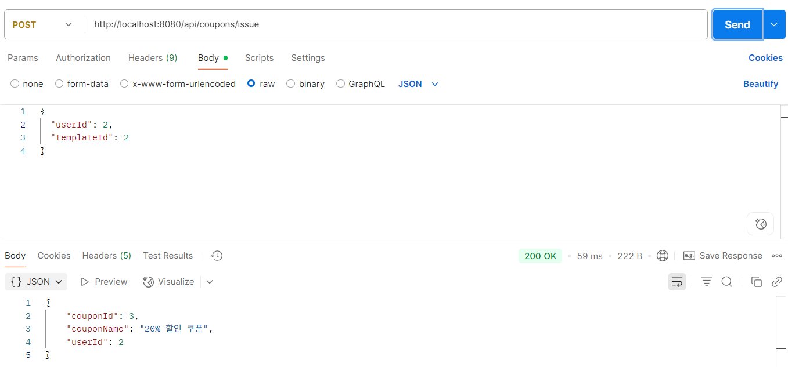
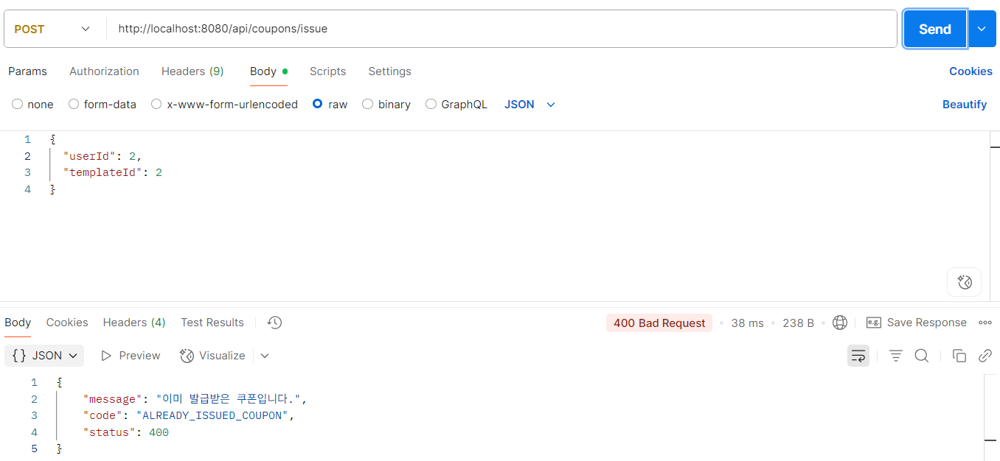
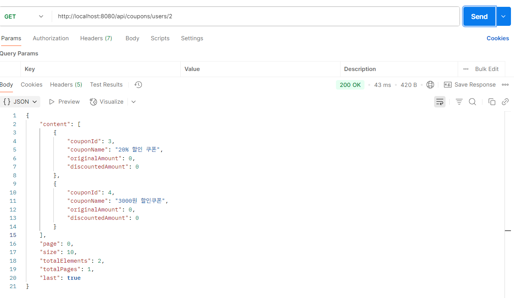

---

## 🎫 쿠폰 발급

**요구사항 요약:**

* 사용자는 특정 쿠폰 템플릿 기반으로 **단 1회만 발급** 가능
* 쿠폰 재고는 **Redis Lua Script로 동시성 안전하게 차감**
* **MySQL에는 실제 발급된 쿠폰만 저장**되며, **발급 가능 여부는 Redis 재고 기준으로 판단**

---

###  처리 흐름

1. 사용자가 `/api/coupons/issue`로 쿠폰 발급 요청 (`POST`)
2. Redis에 쿠폰 재고가 존재하면 Lua Script로 **재고 1 감소**
3. 이미 발급받은 이력이 있는 경우 예외 발생
4. Redis 재고 차감 성공 시, 실제 DB에 쿠폰 저장 (`Coupon` 엔티티)

>  쿠폰 재고는 **MySQL이 아닌 Redis의 수량만 기준**으로 판단되며, DB는 참고용 발급 기록 저장용입니다.

---

### 🧠 기술 적용 요약

| 항목                 | 설명                                                    |
| ------------------ | ----------------------------------------------------- |
| **Lua Script**     | 원자적 재고 차감 처리 (`EVAL`)로 멀티스레드 환경에서도 안전한 발급 보장          |
| **중복 발급 방지**       | DB에 `userId + couponTemplateId` 기준으로 유일 제약 및 발급 이력 검사 |
| **Redis 기준 발급 판정** | 발급 가능 여부는 Redis 재고만으로 판단. DB `issuedCount`는 집계용에 불과   |

---

### 📮 발급 API 예시

** 정상 발급 요청**

**POST** `/api/coupons/issue`

```json
{
  "userId": 2,
  "templateId": 2
}
```

**응답 예시**

```json
{
  "couponId": 3,
  "couponName": "20% 할인 쿠폰",
  "userId": 2
}
```



---

**🚫 중복 발급 시도 (예외)**

같은 쿠폰 템플릿으로 다시 발급 요청 시:

```json
{
  "userId": 2,
  "templateId": 2
}
```

**응답 (400 Bad Request)**

```json
{
  "message": "이미 발급받은 쿠폰입니다.",
  "code": "ALREADY_ISSUED_COUPON",
  "status": 400
}
```



---

### 🗂️ 사용자 쿠폰 목록 조회

**GET** `/api/coupons/users/2`

**응답 예시**

```json
{
  "content": [
    {
      "couponId": 3,
      "couponName": "20% 할인 쿠폰",
      "originalAmount": 0,
      "discountedAmount": 0
    },
    {
      "couponId": 4,
      "couponName": "3000원 할인쿠폰",
      "originalAmount": 0,
      "discountedAmount": 0
    }
  ],
  "page": 0,
  "size": 10,
  "totalElements": 2,
  "totalPages": 1,
  "last": true
}
```



---

