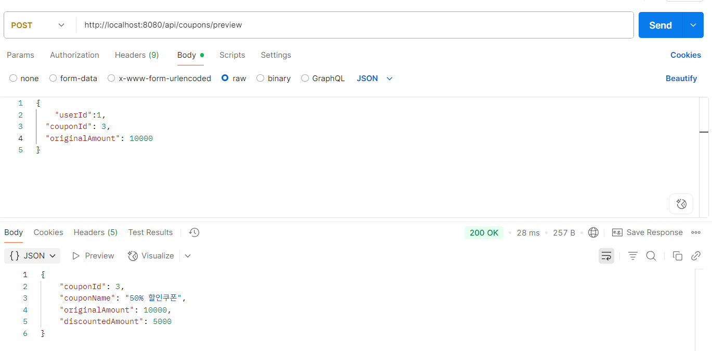

---

##  쿠폰 발급 · 적용 · 할인 미리보기

###  요구사항 정리

| 기능       | 설명                                             |
| -------- | ---------------------------------------------- |
| 쿠폰 발급    | 유저가 직접 발급하거나 조건을 만족할 경우 자동 발급 (예: 조회수 도달)      |
| 쿠폰 할인 적용 | 결제 시 보유 쿠폰을 선택하여 할인 적용 (정액 / 정률 정책에 따라 다르게 처리) |
| 할인 미리보기  | 결제 전에 쿠폰을 적용했을 때 실제 할인 금액을 사전 확인 가능            |
| 쿠폰 목록 조회 | 현재 보유 중인 쿠폰들을 페이징 기반으로 확인 가능                   |

---

###  처리 흐름 요약

1. 관리자는 쿠폰 정책을 미리 등록 (재고, 할인 조건 등)
2. 사용자는 직접 쿠폰 발급 요청 또는 자동 조건 충족 시 쿠폰 발급
3. 결제 시 보유 쿠폰을 적용해 할인 계산
4. 결제 전 할인 미리보기도 가능
5. 사용자는 현재 보유 중인 쿠폰 목록을 조회할 수 있음

---

###  적용 기술 요약

| 항목                   | 설명                                                        |
| -------------------- | --------------------------------------------------------- |
| **Redis Lua Script** | 쿠폰 발급 시 Redis 재고를 원자적으로 차감해 멀티 인스턴스 환경에서도 안전하게 처리         |
| **재고 복구 처리**         | DB 저장 실패 시 Redis 재고를 복원해 데이터 정합성 유지                       |
| **전략 패턴**            | 쿠폰 할인 정책(정액/정률)을 `CouponDiscountPolicy`로 분리해 확장성과 테스트성 확보 |
| **자동 발급 로직**         | 조회수 등 조건 만족 시 자동으로 쿠폰이 발급되며 중복 발급은 방지됨                    |
| **예외 처리**            | 중복 발급, 기간 만료, 최소 주문금액 미달 등 사용자 실수를 방지하기 위한 상세 검증 포함       |

---

###  테스트 결과

| 쿠폰 발급 (선착순)                                                 | 쿠폰 미리보기 결과                                                    |
| ----------------------------------------------------------- | ------------------------------------------------------------- |
|  |  |

 

  <b>✅ 쿠폰 적용 결과 예시</b>  
  

 

### 💸 쿠폰 할인 적용된 결제 결과 예시

---

