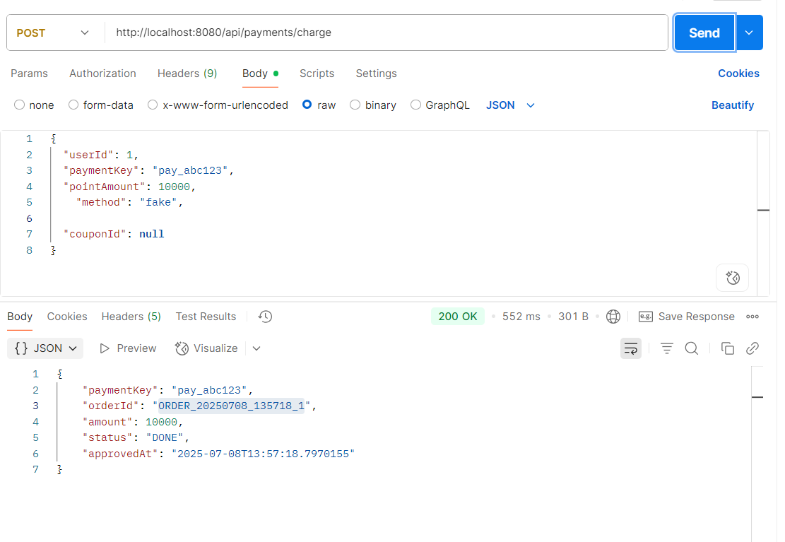

---

##  포인트 충전

**요구사항:**

* 사용자는 토스페이먼츠 기반 결제를 통해 자사 서비스 포인트를 충전할 수 있어야 함
* 포인트는 **1원당 1포인트** 기준으로 적립됨
* 실제 결제 연동 대신 `FakePaymentGateway`를 통해 테스트 환경 제공
* 결제 수단은 `"fake"` 문자열로 지정하고, 전략 패턴 기반으로 구현체(`PaymentGateway`) 분기 처리
* \*\*결제 고유 식별자(orderId)\*\*는 `ORDER_yyyyMMdd_HHmmss_userId` 형식으로 생성되며, 충전 요청 시 자동으로 부여됨

---

###  테스트 조건

* 사용자 ID: `1`
* 결제 수단: `"fake"`
* 충전 요청 금액: `10,000원`
* 쿠폰 없이 단순 충전

**요청 예시:**

```json
{
  "userId": 1,
  "paymentKey": "pay_abc123",
  "pointAmount": 10000,
  "method": "fake",
  "couponId": null
}
```

---

###  적용 기술 요약

| 항목                | 설명                                                                                              |
| ----------------- | ----------------------------------------------------------------------------------------------- |
| **전략 패턴**         | `PaymentGateway` 인터페이스 구현체를 주입하여 `TossPaymentGateway`, `FakePaymentGateway` 분기 처리               |
| **Gateway 선택 방식** | 요청에서 전달받은 `method` 값을 `PaymentMethod.from(String)`으로 파싱한 뒤, `gatewayMap.get(beanName)`으로 구현체 선택 |
| **Order ID 생성**   | `ORDER_yyyyMMdd_HHmmss_userId` 형식으로 고유 주문 ID를 생성하는 `OrderIdGenerator` 유틸 사용                     |
| **Mapper 사용**     | 결제 요청 DTO → 도메인 객체 생성 → 결제 결과 DTO로 변환하여 응답 (`PaymentMapper` 적용)                                 |

---

###  기대 결과

* 충전 요청이 성공적으로 처리되면 다음과 같은 정보가 포함된 응답 반환:

    * `orderId`, `paymentKey`, `amount`, `status`, `approvedAt` 등
* 포인트는 충전 금액만큼 적립됨 (ex. 10,000원 → 10,000 포인트)

---

###  테스트 결과

* 결제 처리 및 포인트 적립이 정상적으로 작동함을 확인
* 아래는 실제 응답 예시 이미지

<br/>



---

